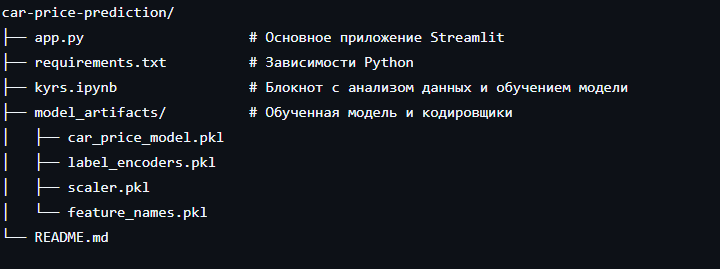
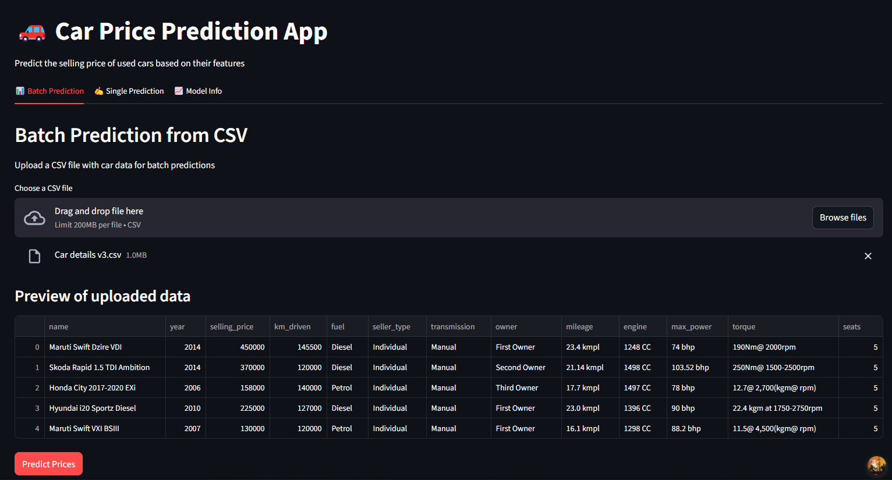
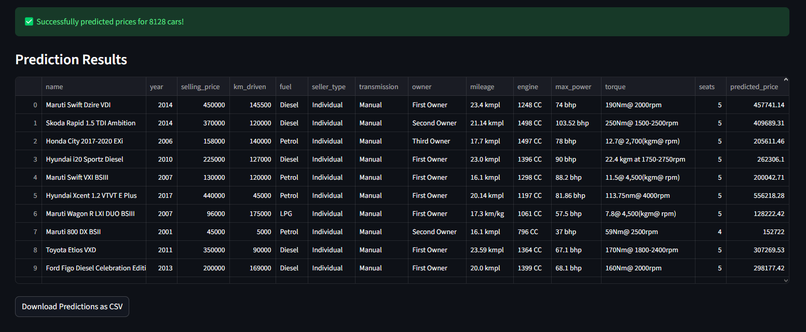
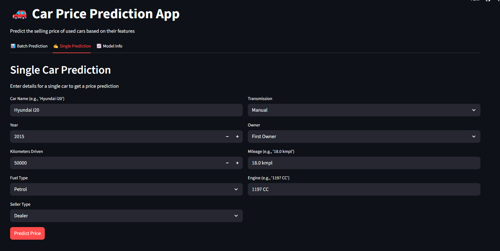
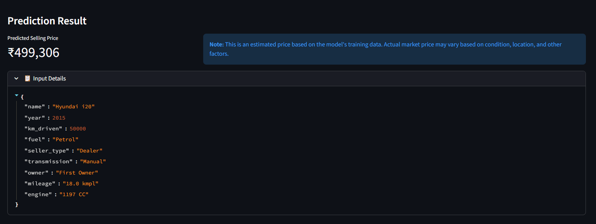

# Прогнозирование цен на подержанные автомобили

Простое веб-приложение на базе машинного обучения, которое предсказывает рыночную стоимость подержанных автомобилей на основе таких характеристик, как пробег, объём двигателя, год выпуска и история владения. 

## Структура проекта

## Возможности
Пакетное предсказание: Загрузка CSV-файлов для множественных прогнозов

Единичное предсказание: Интерактивная форма для оценки стоимости одного автомобиля

## Производительность модели
Взято из kyrs.ipynb

## Датасет
https://www.kaggle.com/datasets/nehalbirla/vehicle-dataset-from-cardekho

Анализ данных можно найти в kyrs.ipynb в п. "Визуализация данных"

## Развёртывание на Streamlit Cloud
- Пакетное предсказание
  
  
-Единичное предсказание
  
    
